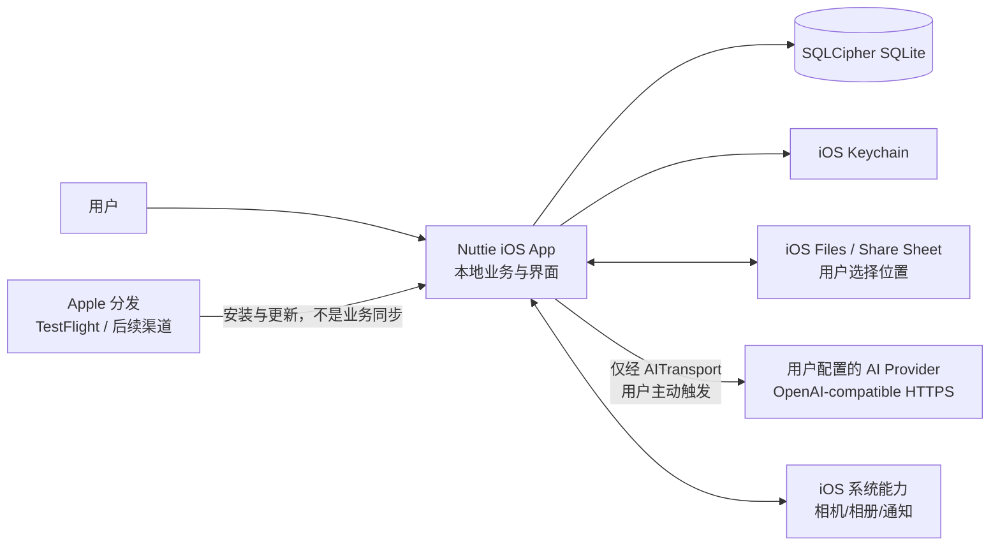
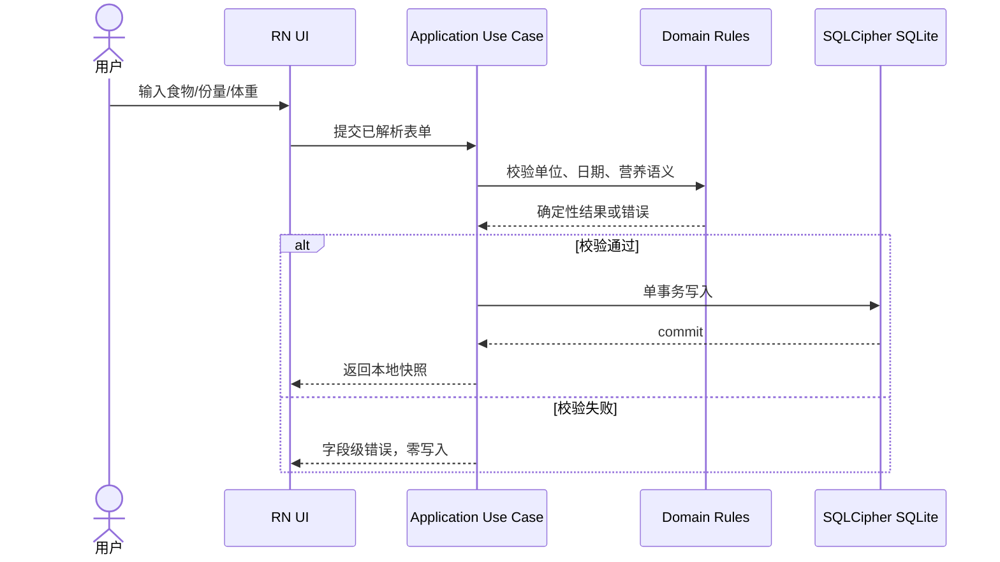
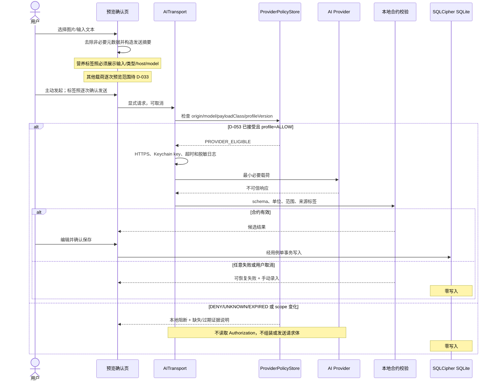
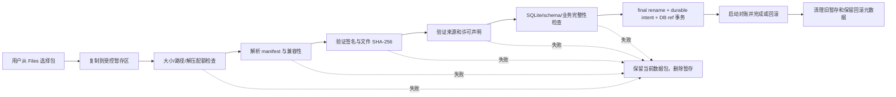

# 本地优先上下文、容器与数据流

> 状态：G4 初版
>
> 关联决策：D-002、D-003、D-004、D-006、D-007、D-012、D-014、D-015；AI 细节候选 D-034、D-036、D-053

## 1. 架构目标

Nuttie 是单设备、本地优先的营养与体重记录 App。生产运行时没有 Nuttie 业务服务器。核心体验在飞行模式下必须可用；唯一允许的业务网络出口是由用户明确触发的 `AITransport`。

这里的“本地优先”不等于设备物理上从不联网：App Store/TestFlight 安装更新、Apple 签名，以及用户主动选择的 iCloud/第三方 Files 位置属于 Apple 或系统边界。Nuttie 自身不得把这些行为表述为业务同步。

## 2. 系统上下文



明确不存在的 Nuttie/第三方生产容器：账号服务、业务 API、远程数据库、推送服务、远程配置、行为分析、崩溃上传器、在线食物查询和 OTA 更新服务。Apple/TestFlight 按平台设置收集诊断不属于 Nuttie 容器，见第 7 节边界说明。

## 3. 逻辑容器

| 容器 | 职责 | 可以依赖 | 禁止事项 |
| --- | --- | --- | --- |
| Presentation | 页面、路由、可访问性、权限说明、确认与失败态 | Application、只读 ViewModel | 直接 SQL、直接网络、直接 Keychain |
| Application | 用例编排、事务边界、权限结果处理 | Domain、Repository ports、Platform ports | 持有 UI 实例、绕过验证写库 |
| Domain | 热量/营养/份量/日期/目标等确定性规则 | 纯 TypeScript 类型与函数 | React Native、SQLite、网络、当前系统时钟的隐式调用 |
| Local Repository | 查询、事务、迁移、来源追踪 | SQLCipher SQLite adapter | 网络、AI 推断、UI 状态 |
| SecretVault | API key、数据库密钥和密钥删除 | iOS Keychain adapter | 返回密钥到日志、普通持久化或备份 |
| AITransport | 唯一网络客户端、HTTPS/baseURL、Provider 用途准入、超时、取消、响应合约；具体 session/redirect profile 待 D-036，用途规则待 D-053 | SecretVault、ProviderPolicyStore、Provider adapter、系统 TLS | 直接写业务库、后台静默上传、重试造成重复写入 |
| ProviderPolicyStore | 本地保存版本化 Provider/载荷用途证据与 `ALLOW/DENY/UNKNOWN/EXPIRED` 状态 | 随 App 发布或 Owner 审核后导入的本地 profile | 运行时联网抓政策、保存 API key、直接发请求 |
| DataPackImporter | Files 导入、签名/哈希/许可/兼容性校验、暂存、durable intent 和启动对账 | Crypto verifier、staging DB、Repository | 在线下载、边验证边覆盖当前数据包、宣称跨文件/DB 单事务 |
| BackupService | 一致性快照、加密封装、恢复预检、generation/pointer 切换与启动对账 | Repository、Crypto envelope、Files | 自动上传、保存明文口令、提交后再验证、跨 Keychain/文件全局事务 |
| Platform adapters | 相机、相册、本地通知、App Group；HealthKit 为第二阶段 | iOS/Expo 原生 API | 把系统权限状态当作已授权、承诺后台必定执行 |
| App Group Snapshot | Widget/Live Activity 的最小、版本化、可过期快照 | 主 App 单向写入 | API key、完整数据库、未确认的敏感数据 |

具体导航、状态、ORM、图表和测试库尚未批准，见 `../decisions/decision-candidates.md`。

## 4. 依赖规则

推荐目录边界仅表示职责，不是已批准的脚手架：

```text
src/
  presentation/       # RN 页面与交互
  application/        # 用例与事务编排
  domain/             # 纯规则、单位和值对象
  infrastructure/
    local/            # SQLite、文件、迁移
    ai/               # 唯一网络边界
    crypto/           # 签名验证与备份封装
  platform/ios/       # 原生 ports 的 JS/TS 侧适配
ios/                  # 检入 Git 的 Xcode 工程与 Swift 目标
```

强制规则：

1. 只有 `infrastructure/ai` 可以导入生产网络客户端或调用 `fetch`。
2. Domain 不读取全局时钟、locale 或 timezone；由用例显式传入时间上下文。
3. Repository 不接受未经 schema 验证的 `unknown`。
4. 外部记录保留 `sourceId`、`sourceVersion`、原值、原单位和导入时间；用户覆盖写到独立表，不修改上游记录。
5. 视图状态可以丢失并重建；业务数据不能只存在于状态管理库。

## 5. 数据流

### 5.1 本地记录



### 5.2 AI 文本、照片或标签识别



AITransport 的硬约束：

- 每个用户独立配置 `baseURL`、`model`、`key`；不提供内置共享密钥。
- Release 只接受 `https:`，且不得把 Authorization 或载荷发送给用户未确认的 origin。
- 请求只在前台用户动作后创建；不做静默后台请求。
- 在读取 AI key 或组装 Authorization/敏感 body 前，必须用本地版本化 `ProviderPolicyProfile` 对规范化 origin、model 与 payload class 做用途准入。D-053 未接受，或状态为 `DENY`、`UNKNOWN`、`EXPIRED`、scope 不匹配时 fail closed。
- 营养标签照片按 D-014 首次说明且每次展示输入、数据类型、实际 host 和 model 后确认；餐食照片、纯文本和趋势摘要是否同样逐次预览仍待 D-033。
- 401/403、429、超时、TLS、取消、非合约响应全部是可恢复失败，不自动换 Provider，也不写库。
- HealthKit 数据默认不进入 AI 请求；未来若改变必须形成新决策和单独同意。

`ProviderPolicyProfile` 至少记录 `providerId`、规范化 origin、允许的 model/payload class 范围、terms/privacy URL 或离线快照 SHA-256、核验日期/到期日、保留、训练、人工访问、删除机制、广告/营销和健康数据用途，以及 `ALLOW/DENY/UNKNOWN/EXPIRED`。profile 只从 App 发版内置或 Owner 审核后的本地配置获得；Nuttie 运行时不为更新政策而新增联网出口。host、model、payload class、证据哈希或 profile 版本变化都会失效并重新进入 `UNKNOWN`。

D-053 决定何种证据和残余风险可以产生 `ALLOW`；D-033 只决定用户看到和确认载荷的频率，不能把 `UNKNOWN` 变成 `ALLOW`。即使 Owner 选择逐 Provider 复核，也不能把 Apple 明确禁止的数据用途标为允许。D-053 未接受且没有通过复核的 profile 前，AITransport 可以做本地 UI/合约 Spike，但不能发送真实健康或营养载荷，也不能获得发布门禁通过。

具体 URL userinfo/query/fragment、全部 3xx、cookie/cache/credential 和 session 隔离会影响 Provider 兼容性，未包含在 D-004 的 HTTPS 决策内。D-036 的推荐 profile 是专属 ephemeral/no-cache/no-cookie/no-persistent-credential session、全部 3xx 终止、禁止 WebView/remote Image 加载 Provider 内容；若 RN `fetch` 不能证明这些性质，则用窄接口原生 transport Spike。该 profile 未经 Owner 确认前只能作为 proposed 发布阻断项。

无论 D-036 最终选择何种 profile，请求/响应临时文件都必须在成功、失败、取消、超限、wipe 和下次启动清理；D-034 必须冻结输入、像素、请求、响应、流、JSON、并发和临时磁盘预算。

### 5.3 签名数据包导入



### 5.4 加密备份与恢复

导出先创建一致性快照，再生成版本化明文载荷，最后整体加密；任何明文暂存都必须使用系统文件保护并在成功、失败或中断后清理。恢复在独立 staging 中完成认证、完整性校验和所有迁移，再以目标设备既有 SQLCipher key 构建不可变 generation，通过 durable restore intent、同卷 active pointer 替换和启动对账完成或回滚。该协议保证 crash consistency，不宣称 Keychain、文件目录和 pointer 构成全局原子事务。恢复采用“替换”还是“合并”、是否自动建立恢复点尚待 D-030；流式认证隔离待 D-027。

## 6. 本地性分级

| 分级 | 含义 | 示例 |
| --- | --- | --- |
| `PURE_LOCAL` | 无网络且不依赖 Apple 云服务即可完成 | 日记、目标、体重、统计、手动录入 |
| `AI_ONLY_NETWORK` | 只有明确触发的 AI 推断联网，保存与校验本地 | AI 文本/照片/标签识别 |
| `LOCAL_REPLACEMENT` | 用本地能力替代竞品服务端能力 | 离线条码库、本地档案、加密备份 |
| `IOS_OR_DISTRIBUTION_LIMIT` | 受权限、后台调度、签名或分发限制 | 本地通知、Widget、TestFlight |
| `EVIDENCE_GAP` | 竞品或数据证据不足，不能成为确定承诺 | 条码命中率、未证实高级操作 |

## 7. 可观测性

生产 App 不内置 Nuttie 或第三方远程遥测/崩溃上传器。Apple/TestFlight 仍可能按平台和测试者设置收集诊断与反馈，属于分发平台边界，不能声称任何测试构建都绝无数据离机。App 自身允许：

- 本地结构化诊断事件，默认不含食物文本、图片、Health 数据、URL query、Authorization 和密钥。
- 用户明确选择后导出脱敏诊断包。
- 开发构建使用 Xcode/Expo 本地工具；生产构建不包含开发启动器入口和网络检查器。

诊断日志必须有大小上限、轮转、清除入口，并随“删除全部数据”一起删除。
